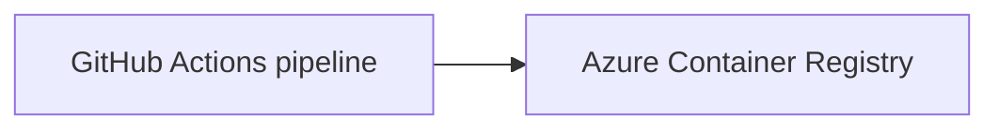

## Overview

Shape: image

The repository has no application entry point, listener, or command-line workload; its only documented executable command is the Python documentary test, so it is an image rather than a cloud runtime.

This setup publishes a container image containing the documentation candidate and its referee test to Azure Container Registry (ACR). GitHub Actions provides CI/CD and Azure is the cloud target. Terraform owns the deployment resource group and registry; it does not start a service or job.



## Prerequisites

The repository itself requires Python 3 (no narrower version is declared). To administer this setup, install Azure CLI 2.x, Terraform 1.6 or later, Docker, GitHub CLI 2.x, and Git. The workflow pins Terraform 1.6.6 and uses GitHub Action major versions.

The setup person needs an Azure subscription in which they can create resource groups, storage accounts, an ACR, a user-assigned managed identity, role assignments, and a federated credential. They also need repository administration rights to create Actions variables and a GitHub environment with a required reviewer. The identity created below needs only the named role assignments; no client secret, registry password, or storage key is used.

## One-time setup

Set the following shell values before creating anything. Replace the example names with globally unique names where required; do not put an account, subscription, token, or password in a repository file.

```bash
az login
export GITHUB_REPOSITORY="OWNER/REPOSITORY"
export AZURE_LOCATION="westeurope"
export TFSTATE_RESOURCE_GROUP="rg-evidence-tfstate-example"
export TFSTATE_STORAGE_ACCOUNT="stevidenceexample1234"
export TFSTATE_CONTAINER="tfstate"
export TFSTATE_KEY="terraform.tfstate"
export AZURE_RESOURCE_GROUP="rg-evidence-production-example"
export ACR_NAME="acrevidenceexample1234"
export IMAGE_NAME="evidence-definition"
export GITHUB_BUILD_IDENTITY_NAME="id-evidence-build-example"
export GITHUB_APPLY_IDENTITY_NAME="id-evidence-apply-example"
```

Create the Terraform-state resource group, storage account, and private state container. The person running these commands must have data-plane access to create the container.

```bash
az group create --name "$TFSTATE_RESOURCE_GROUP" --location "$AZURE_LOCATION"
az storage account create --name "$TFSTATE_STORAGE_ACCOUNT" --resource-group "$TFSTATE_RESOURCE_GROUP" --location "$AZURE_LOCATION" --sku Standard_LRS --kind StorageV2 --allow-blob-public-access false --min-tls-version TLS1_2
az storage container create --name "$TFSTATE_CONTAINER" --account-name "$TFSTATE_STORAGE_ACCOUNT" --auth-mode login
```

Create two user-assigned managed identities. The build identity is limited to pushing the image, reading production resources, and reading/writing Terraform state from `main`. The apply identity holds the production Contributor role and is federated only to the protected GitHub environment, so a required reviewer gates every infrastructure change. Create the `production` environment with a reviewer before a workflow can apply Terraform.

```bash
az identity create --name "$GITHUB_BUILD_IDENTITY_NAME" --resource-group "$TFSTATE_RESOURCE_GROUP" --location "$AZURE_LOCATION"
az identity create --name "$GITHUB_APPLY_IDENTITY_NAME" --resource-group "$TFSTATE_RESOURCE_GROUP" --location "$AZURE_LOCATION"
export AZURE_CLIENT_ID="$(az identity show --name "$GITHUB_BUILD_IDENTITY_NAME" --resource-group "$TFSTATE_RESOURCE_GROUP" --query clientId --output tsv)"
export AZURE_PRINCIPAL_ID="$(az identity show --name "$GITHUB_BUILD_IDENTITY_NAME" --resource-group "$TFSTATE_RESOURCE_GROUP" --query principalId --output tsv)"
export AZURE_APPLY_CLIENT_ID="$(az identity show --name "$GITHUB_APPLY_IDENTITY_NAME" --resource-group "$TFSTATE_RESOURCE_GROUP" --query clientId --output tsv)"
export AZURE_APPLY_PRINCIPAL_ID="$(az identity show --name "$GITHUB_APPLY_IDENTITY_NAME" --resource-group "$TFSTATE_RESOURCE_GROUP" --query principalId --output tsv)"
export AZURE_TENANT_ID="$(az account show --query tenantId --output tsv)"
export AZURE_SUBSCRIPTION_ID="$(az account show --query id --output tsv)"
az identity federated-credential create --name github-main --identity-name "$GITHUB_BUILD_IDENTITY_NAME" --resource-group "$TFSTATE_RESOURCE_GROUP" --issuer "https://token.actions.githubusercontent.com" --subject "repo:$GITHUB_REPOSITORY:ref:refs/heads/main" --audiences "api://AzureADTokenExchange"
az identity federated-credential create --name github-production --identity-name "$GITHUB_APPLY_IDENTITY_NAME" --resource-group "$TFSTATE_RESOURCE_GROUP" --issuer "https://token.actions.githubusercontent.com" --subject "repo:$GITHUB_REPOSITORY:environment:production" --audiences "api://AzureADTokenExchange"
```

Create the protected GitHub environment, set one reviewer, and restrict deployments to `main`. `REVIEWER_LOGIN` must be a GitHub user who is permitted to review deployments for this repository.

```bash
export REVIEWER_LOGIN="octo-reviewer"
export REVIEWER_GITHUB_ID="$(gh api "users/$REVIEWER_LOGIN" --jq .id)"
gh api --method PUT "repos/$GITHUB_REPOSITORY/environments/production" --input - <<EOF
{"wait_timer":0,"prevent_self_review":true,"reviewers":[{"type":"User","id":$REVIEWER_GITHUB_ID}],"deployment_branch_policy":{"protected_branches":false,"custom_branch_policies":true}}
EOF
gh api --method POST "repos/$GITHUB_REPOSITORY/environments/production/deployment-branch-policies" -f name=main
```

The registry must exist before the workflow can push its first image. Create the Terraform-managed resource group and registry once, then import them into the remote state; import changes state only, not Azure resources.

```bash
az group create --name "$AZURE_RESOURCE_GROUP" --location "$AZURE_LOCATION"
az acr create --name "$ACR_NAME" --resource-group "$AZURE_RESOURCE_GROUP" --location "$AZURE_LOCATION" --sku Basic --admin-enabled false
export ACR_ID="$(az acr show --name "$ACR_NAME" --resource-group "$AZURE_RESOURCE_GROUP" --query id --output tsv)"
export TFSTATE_STORAGE_ID="$(az storage account show --name "$TFSTATE_STORAGE_ACCOUNT" --resource-group "$TFSTATE_RESOURCE_GROUP" --query id --output tsv)"
az role assignment create --assignee-object-id "$AZURE_PRINCIPAL_ID" --assignee-principal-type ServicePrincipal --role Reader --scope "/subscriptions/$AZURE_SUBSCRIPTION_ID/resourceGroups/$AZURE_RESOURCE_GROUP"
az role assignment create --assignee-object-id "$AZURE_PRINCIPAL_ID" --assignee-principal-type ServicePrincipal --role AcrPush --scope "$ACR_ID"
az role assignment create --assignee-object-id "$AZURE_PRINCIPAL_ID" --assignee-principal-type ServicePrincipal --role "Storage Blob Data Contributor" --scope "$TFSTATE_STORAGE_ID"
az role assignment create --assignee-object-id "$AZURE_APPLY_PRINCIPAL_ID" --assignee-principal-type ServicePrincipal --role Contributor --scope "/subscriptions/$AZURE_SUBSCRIPTION_ID/resourceGroups/$AZURE_RESOURCE_GROUP"
az role assignment create --assignee-object-id "$AZURE_APPLY_PRINCIPAL_ID" --assignee-principal-type ServicePrincipal --role "Storage Blob Data Contributor" --scope "$TFSTATE_STORAGE_ID"
terraform -chdir=infra init -input=false -backend-config="resource_group_name=$TFSTATE_RESOURCE_GROUP" -backend-config="storage_account_name=$TFSTATE_STORAGE_ACCOUNT" -backend-config="container_name=$TFSTATE_CONTAINER" -backend-config="key=$TFSTATE_KEY" -backend-config="use_azuread_auth=true"
terraform -chdir=infra import -var="resource_group_name=$AZURE_RESOURCE_GROUP" -var="location=$AZURE_LOCATION" -var="container_registry_name=$ACR_NAME" -var="image_tag=bootstrap" azurerm_resource_group.this "/subscriptions/$AZURE_SUBSCRIPTION_ID/resourceGroups/$AZURE_RESOURCE_GROUP"
terraform -chdir=infra import -var="resource_group_name=$AZURE_RESOURCE_GROUP" -var="location=$AZURE_LOCATION" -var="container_registry_name=$ACR_NAME" -var="image_tag=bootstrap" azurerm_container_registry.this "$ACR_ID"
```

Create the repository Actions variables. This setup uses no GitHub Actions secrets: OIDC exchanges GitHub's short-lived token for the managed identity, and all listed values are identifiers or non-secret names.

```bash
gh variable set AZURE_CLIENT_ID --repo "$GITHUB_REPOSITORY" --body "$AZURE_CLIENT_ID"
gh variable set AZURE_APPLY_CLIENT_ID --repo "$GITHUB_REPOSITORY" --body "$AZURE_APPLY_CLIENT_ID"
gh variable set AZURE_TENANT_ID --repo "$GITHUB_REPOSITORY" --body "$AZURE_TENANT_ID"
gh variable set AZURE_SUBSCRIPTION_ID --repo "$GITHUB_REPOSITORY" --body "$AZURE_SUBSCRIPTION_ID"
gh variable set AZURE_LOCATION --repo "$GITHUB_REPOSITORY" --body "$AZURE_LOCATION"
gh variable set AZURE_RESOURCE_GROUP --repo "$GITHUB_REPOSITORY" --body "$AZURE_RESOURCE_GROUP"
gh variable set ACR_NAME --repo "$GITHUB_REPOSITORY" --body "$ACR_NAME"
gh variable set IMAGE_NAME --repo "$GITHUB_REPOSITORY" --body "$IMAGE_NAME"
gh variable set TFSTATE_RESOURCE_GROUP --repo "$GITHUB_REPOSITORY" --body "$TFSTATE_RESOURCE_GROUP"
gh variable set TFSTATE_STORAGE_ACCOUNT --repo "$GITHUB_REPOSITORY" --body "$TFSTATE_STORAGE_ACCOUNT"
gh variable set TFSTATE_CONTAINER --repo "$GITHUB_REPOSITORY" --body "$TFSTATE_CONTAINER"
gh variable set TFSTATE_KEY --repo "$GITHUB_REPOSITORY" --body "$TFSTATE_KEY"
```

## Secrets and variables

| Name | Secret or variable | Where the value comes from | Example value that is not real |
|---|---|---|---|
| `AZURE_CLIENT_ID` | Variable | `clientId` of the user-assigned identity | `11111111-2222-3333-4444-555555555555` |
| `AZURE_APPLY_CLIENT_ID` | Variable | `clientId` of the protected-environment apply identity | `55555555-6666-7777-8888-999999999999` |
| `AZURE_TENANT_ID` | Variable | `az account show --query tenantId` | `aaaaaaaa-bbbb-cccc-dddd-eeeeeeeeeeee` |
| `AZURE_SUBSCRIPTION_ID` | Variable | `az account show --query id` | `00000000-1111-2222-3333-444444444444` |
| `AZURE_LOCATION` | Variable | Chosen Azure region | `westeurope` |
| `AZURE_RESOURCE_GROUP` | Variable | Production resource-group name | `rg-evidence-production-example` |
| `ACR_NAME` | Variable | Globally unique ACR name | `acrevidenceexample1234` |
| `IMAGE_NAME` | Variable | Image repository name chosen for this candidate | `evidence-definition` |
| `TFSTATE_RESOURCE_GROUP` | Variable | State resource-group name | `rg-evidence-tfstate-example` |
| `TFSTATE_STORAGE_ACCOUNT` | Variable | Globally unique state storage-account name | `stevidenceexample1234` |
| `TFSTATE_CONTAINER` | Variable | State blob-container name | `tfstate` |
| `TFSTATE_KEY` | Variable | State blob name | `terraform.tfstate` |
| None | Secret | No secret is required by these workflows. | — |

## Deploying

For the first deployment, complete the bootstrap and imports above, commit these files, and push to `main`. CI checks the documented Python test and builds an image without pushing it. The deploy workflow then builds the same image, tags it with the commit SHA, and pushes it to ACR using OIDC. It runs `terraform fmt -check`, `init`, `validate`, and `plan`; the SHA is passed as `image_tag`. The `apply` job is bound to `production`, so its required reviewer must approve before it applies the saved plan.

Everyday deployment is the same: merge a change into `main`. To start it manually from the default branch, run:

```bash
gh workflow run deploy.yml --repo "$GITHUB_REPOSITORY" --ref main
```

This is an image-only deployment. To pull and run the published documentary test image on demand, use a commit SHA from the deployment run:

```bash
export IMAGE_TAG="0123456789abcdef0123456789abcdef01234567"
export ACR_LOGIN_SERVER="$(az acr show --name "$ACR_NAME" --query loginServer --output tsv)"
az acr login --name "$ACR_NAME"
docker pull "$ACR_LOGIN_SERVER/$IMAGE_NAME:$IMAGE_TAG"
docker run --rm "$ACR_LOGIN_SERVER/$IMAGE_NAME:$IMAGE_TAG"
```

## Rolling back

There is no deployed runtime to roll back. Consumers roll back by pulling an earlier commit-SHA image tag:

```bash
export ROLLBACK_IMAGE_TAG="0123456789abcdef0123456789abcdef01234567"
export ACR_LOGIN_SERVER="$(az acr show --name "$ACR_NAME" --query loginServer --output tsv)"
az acr login --name "$ACR_NAME"
docker pull "$ACR_LOGIN_SERVER/$IMAGE_NAME:$ROLLBACK_IMAGE_TAG"
docker run --rm "$ACR_LOGIN_SERVER/$IMAGE_NAME:$ROLLBACK_IMAGE_TAG"
```

Terraform state records the resource group and ACR only. The `image_tag` reaches every plan but does not represent a runtime or image selection in state, so Terraform cannot roll an image tag backward.

## Configuration

The repository reads no environment variables; therefore no `.env.example` is created and no application configuration is passed to Azure. `resource_group_name`, `location`, and `container_registry_name` are required Terraform inputs and come from the similarly named GitHub Actions variables documented above. `image_tag` is the Git commit SHA produced by the workflow; `tags` is optional and defaults to an empty map in Terraform.

This shape has no service, job, replicas, CPU, memory, port, health endpoint, or schedule. The ACR SKU is `Basic` in `infra/main.tf`; change it in Terraform only when a different registry tier is needed.

## Monitoring and logs

The image has no running Azure workload, application log stream, metrics stream, or health check. GitHub Actions retains workflow output, and Azure Activity Log records management operations for the registry. Read the latest workflow logs and registry activity with:

```bash
gh run list --repo "$GITHUB_REPOSITORY" --workflow deploy.yml --limit 1
az monitor activity-log list --resource-id "$(az acr show --name "$ACR_NAME" --query id --output tsv)" --max-events 20 --output table
az monitor metrics list-definitions --resource "$(az acr show --name "$ACR_NAME" --query id --output tsv)" --output table
```

No health-check command exists because no process runs in Azure. Running the pulled image executes the documented referee test instead.

## Cost

The Basic ACR incurs registry charges driven by its selected SKU and stored image data. The Terraform state storage account incurs storage and transaction charges. Azure Activity Log retention and any separately enabled monitoring destinations can add cost. The user-assigned managed identity has no direct charge. This shape creates no Container Apps environment, compute workload, database, or always-on replica.

## Troubleshooting

| Symptom | Fix |
|---|---|
| `azure/login` cannot acquire an OIDC token | Confirm both identity client-ID variables, tenant ID, and subscription ID. The build identity must use `repo:OWNER/REPOSITORY:ref:refs/heads/main`; the apply identity must use `repo:OWNER/REPOSITORY:environment:production`; both use issuer `https://token.actions.githubusercontent.com` and audience `api://AzureADTokenExchange`. |
| `docker push` is denied by ACR | Confirm the bootstrap ACR exists, `ACR_NAME` is correct, and the managed identity has `AcrPush` on the registry resource ID. |
| Terraform reports a state lock | Wait for the active run to finish, inspect it with `gh run list --repo "$GITHUB_REPOSITORY" --workflow deploy.yml`, then retry. Do not delete the state blob or break a lock until the owner is known. |
| Image pull is denied or tag is absent | Authenticate with `az acr login --name "$ACR_NAME"`, use the login server reported by `az acr show`, and verify tags with `az acr repository show-tags --name "$ACR_NAME" --repository "$IMAGE_NAME" --output table`. |
| A health check is reported as failing | This setup defines no Azure runtime or health check. If this refers to `docker run`, inspect the documentary test output; its existing failures must be fixed in the candidate records by their authorized maintainer, not in deployment files. |

## Tearing down

Tear down the Terraform-managed production resource group from a workstation authenticated with `az login`. This destroys the ACR and the resource group after confirmation. It intentionally leaves the state storage account/container and both GitHub federated identities in the separate state resource group so that state history and identity administration remain recoverable; remove them explicitly only after no repository uses them.

```bash
terraform -chdir=infra init -input=false -backend-config="resource_group_name=$TFSTATE_RESOURCE_GROUP" -backend-config="storage_account_name=$TFSTATE_STORAGE_ACCOUNT" -backend-config="container_name=$TFSTATE_CONTAINER" -backend-config="key=$TFSTATE_KEY" -backend-config="use_azuread_auth=true"
terraform -chdir=infra destroy -var="resource_group_name=$AZURE_RESOURCE_GROUP" -var="location=$AZURE_LOCATION" -var="container_registry_name=$ACR_NAME" -var="image_tag=teardown"
```

After the destroy, delete the GitHub Actions variables and `production` environment if they are no longer used. The state storage and managed identities are not Terraform resources in this root and are deliberately left behind.

## Changes the application needs

None. This repository has no application code, runtime entry point, hard-coded port, host, or path; the image runs the existing documentary test command.
